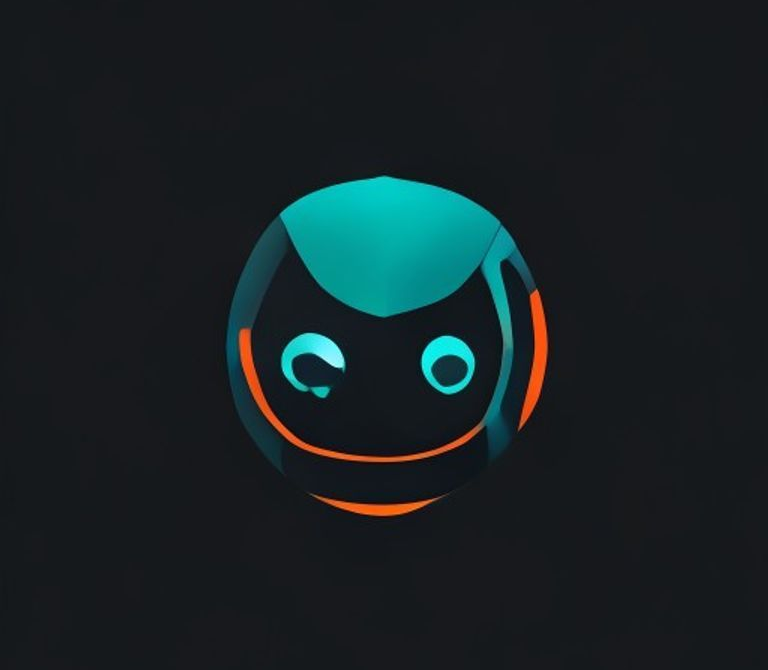

# Marvik

WhatsApp bot built on Baileys with a modular plugin system, centralized state storage, and a plugin/runtime split that is meant to stay maintainable as the bot grows.



## What This Bot Has

- WhatsApp-first runtime built on `@whiskeysockets/baileys`
- Modular plugin system in `src/plugins`
- Centralized persistent state in `storage/storage.json`
- Dedicated `state`, `domains`, `core`, `plugins`, and `utils` layers
- Hot reload for `.env` and plugin files
- Owner/admin/group permission handling
- Media, AI, games, moderation, downloads, scheduling, and group tooling

## Ownership And Usage

This project is source-available and protected.

- you may view the source
- you may fork it on GitHub
- you may contribute through pull requests

You may not rebrand, redistribute, sublicense, sell, or present this project or modified versions of it as your own work without prior written permission.

See:

- [LICENSE](./LICENSE)
- [NOTICE.md](./NOTICE.md)

## Quick Start

1. Install dependencies:

```bash
npm install
```

2. Create `.env` from the example:

```bash
cp .env.example .env
```

3. Edit `.env` with at least:

```env
BOT_NAME=Marvik
PREFIX=.
OWNER_NUMBER=2347000000000
BOT_LANG=en
ENABLE_WHATSAPP=true
```

4. Start the bot:

```bash
npm start
```

5. Pair WhatsApp on first run:
- QR code
- or 8-digit pairing code

Session data is stored in `session/whatsapp/`.

## Using The Bot

- `.menu` shows grouped commands
- `.help` lists commands
- `.help <command>` shows usage for one command

Some commands are:
- owner-only
- admin-only
- group-only

The command metadata is enforced by the runtime, not by manual checks inside each plugin.

`docs/COMMANDS.md` is generated from plugin metadata. After adding or changing commands, run `npm run docs:commands`.

## Documentation Index

- [Architecture](./docs/ARCHITECTURE.md)
- [Configuration](./docs/CONFIGURATION.md)
- [Runtime Reference](./docs/RUNTIME_REFERENCE.md)
- [Plugin Guide](./docs/PLUGIN_GUIDE.md)
- [Commands Overview](./docs/COMMANDS.md)
- [Quick Recipes](./docs/QUICK_RECIPES.md)
- [Troubleshooting](./docs/TROUBLESHOOTING.md)
- [Contributing](./CONTRIBUTING.md)

## Project Layout

```text
src/
  adapters/            Platform adapters
  config/              Runtime config/bootstrap defaults
  core/                Bot lifecycle, loader, registry, context
  domains/whatsapp/    WhatsApp-specific behavior
  plugins/             Commands and message hooks
  state/               Persistent state/domain storage
  utils/               Generic helpers

storage/
  storage.json         Central bot state
  messages/            Per-message archive for memory/antidelete flows
```

## Notes

- Runtime state is centered in `storage/storage.json`.
- Message archives under `storage/messages/` are intentionally separate from `storage.json`.
- Plugins are hot-reloaded when files under `src/plugins/` change.
- `.env` is hot-reloaded too.

## Troubleshooting

- If pairing fails repeatedly, clear `session/whatsapp/` and pair again.
- If media commands fail, confirm the quoted/original media is still available from WhatsApp.
- If AI commands fail, check `GROQ_API_KEY`.
- If YouTube is blocked, configure cookies via `YOUTUBE_COOKIES` or `YOUTUBE_COOKIES_FILE`.
